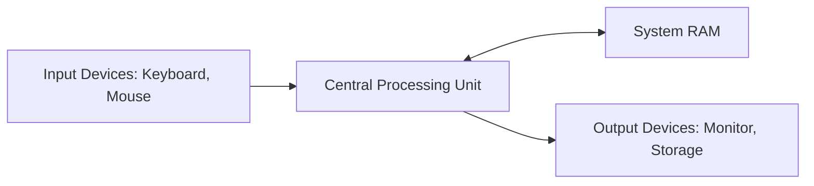
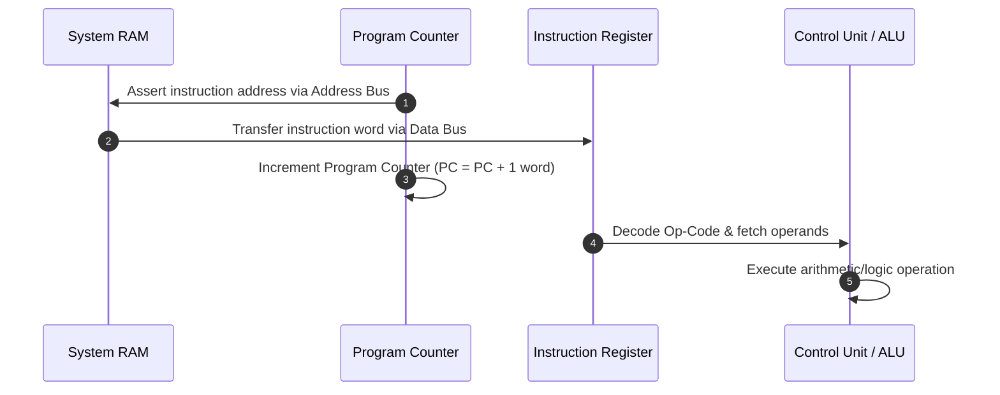

# Computer Architecture & The CPU Instruction Cycle

An architectural overview of central processing unit (CPU) subsystems, register pipelines, and the continuous instruction execution lifecycle.

> [!abstract] Core Function
> The primary role of the CPU is to sequentially retrieve binary instructions from system memory, decode their operational intent, and orchestrate execution across internal arithmetic and register pathways.

---

## 1. Primary Hardware Components

- **Control Unit (CU)**: Decodes instructions and generates control bus timing signals.
- **Arithmetic Logic Unit (ALU)**: Executes integer math and bitwise logical operations.
- **Registers**: Ultra-low-latency on-die memory storage locations.
  - **Program Counter (PC)**: Stores the memory address of the next instruction awaiting execution.
  - **Instruction Register (IR)**: Latches the fetched instruction op-code and operand while decoding occurs.
  - **Memory Address Register (MAR) / Memory Buffer Register (MBR)**: Interfaces directly with the system address and data buses.

---

## 2. The Instruction Execution Pipeline (Fetch-Decode-Execute)

### Detailed Operational Phases
1. **Fetch**: The control unit transfers the address in the Program Counter (PC) to the address bus. System RAM returns the instruction byte to the data bus, latching it into the Instruction Register (IR). Immediately upon retrieval, the processor increments the PC to index the consecutive instruction address.
2. **Decode**: The decoder logic inside the Control Unit evaluates the instruction bit-pattern, determining the required machine operation, addressing mode, and target register operands.
3. **Execute**: The ALU executes the operation (e.g., adding registers, asserting branch jumps, or reading/writing cache memory).
4. **Store / Write-Back**: The computation result is committed to internal general-purpose registers or main memory.

---

## Related Notes
- [[Academic MOC]]
- [[Data Structures & Algorithms - Fundamentals]]
- [[Hardware Security Keys - FIDO2 & WebAuthn]]
