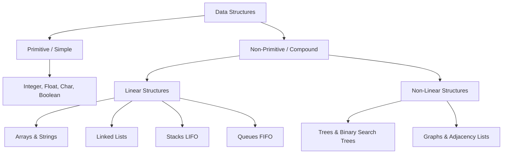

# Data Structures & Algorithms: Fundamentals

Core concepts introducing memory organization paradigms, procedural algorithm efficiency, and fundamental structural taxonomy.

> [!abstract] Fundamental Definition
> - **Data Structure**: Systematic methodology for organizing, managing, and storing data elements in memory to enable efficient access and modification.
> - **Algorithm**: A finite, unambiguous step-by-step procedural sequence designed to resolve a computational problem or perform a calculation.

---

## 1. Rationale: Why Data Structures Matter

1. **Time Efficiency**: Minimizes algorithmic time complexity for core primitives (lookup, insertion, deletion, traversal).
2. **Space Efficiency**: Minimizes memory overhead and cache invalidation.
3. **Problem-Specific Optimization**: Ensures selection of the appropriate data structure tailored to precise algorithmic constraints (e.g., hash maps for $O(1)$ search versus binary search trees for ordered traversal).

---

## 2. Structural Taxonomy & Classification

### Classification Breakdown
- **Primitive (Simple)**: Built directly into machine architecture and language runtime (`int`, `float`, `char`, `bool`).
- **Non-Primitive (Compound)**: Formed by grouping primitive elements together.
  - **Linear Structures**: Sequential memory or pointer traversal where elements possess unique predecessor and successor relationships.
    - *Arrays & Strings*: Contiguous memory allocations offering $O(1)$ index access.
    - *Stacks*: Last-In, First-Out (LIFO) operational constraint.
    - *Queues*: First-In, First-Out (FIFO) operational constraint.
  - **Non-Linear Structures**: Multi-level hierarchical or interconnected topologies.
    - *Trees*: Hierarchical acyclic structures with root and child nodes (e.g., BST, AVL, Heaps).
    - *Graphs*: Generalized networks consisting of vertices ($V$) connected by directional or weighted edges ($E$).

---

## Related Notes
- [[Academic MOC]]
- [[Computer Architecture & CPU Fetch Cycle]]
- [[Compfest CTF Writeup - Crypto & Forensics]]
