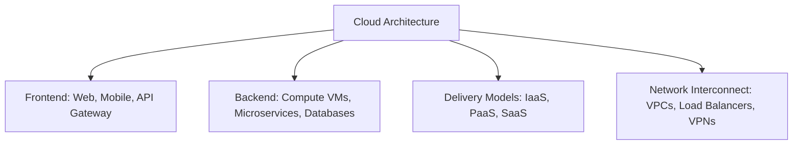

# Cloud Architecture & Delivery Models

Structural analysis of distributed cloud components, architectural design principles, and enterprise service delivery tiers.

> [!abstract] Definition
> Cloud architecture governs the composite arrangement and interaction of hardware nodes, virtualization hypervisors, storage clusters, and network fabrics that collectively deliver elastic compute resources to client endpoints.

---

## 1. Core Architectural Pillars

### Essential Design Principles
- **Scalability**: The capacity of a system to accommodate increasing resource demands by expanding vertically (scaling up CPU/RAM) or horizontally (adding container/VM nodes).
- **Elasticity**: The automated, dynamic provisioning and de-provisioning of cloud instances based on real-time computational load spikes.
- **High Availability (HA)**: Architectural resilience ensuring continuous operational uptime via multi-zone redundancy and automated failover routing.
- **Security & Multi-Tenancy**: Strict cryptographic and network boundary isolation between independent tenant workloads sharing identical physical hypervisors.
- **Cost Efficiency**: Right-sizing workloads and utilizing spot/serverless architectures to eliminate idle hardware overhead.

---

## 2. Cloud Deployment Topologies

| Model | Infrastructure Ownership | Access Control | Primary Use Case |
| :--- | :--- | :--- | :--- |
| **Public Cloud** | Third-party provider (AWS, GCP, Azure) | Multi-tenant over public internet | Rapid scaling, cost optimization, public SaaS |
| **Private Cloud** | Dedicated enterprise hardware | Single organization via private intranet | Strict regulatory compliance, data sovereignty |
| **Hybrid Cloud** | Integrated public and private environments | Secure interconnect (Direct Connect/VPN) | Cloud bursting, sensitive workload containment |

---

## 3. Evaluation: Strategic Tradeoffs

### Operational Advantages
- Rapid time-to-market and near-zero hardware procurement lead times.
- Elastic auto-scaling responding smoothly to irregular traffic spikes.
- Shift from capital expenditure (CapEx) to operational expenditure (OpEx).
- Automatic provider-managed hypervisor patching and security compliance.

### Operational Risks & Mitigations
- **Network Dependency**: Total outage susceptibility when upstream ISP connectivity drops.
- **Data Privacy & Compliance**: Regulatory jurisdiction complications (e.g., GDPR, data residency).
- **Uncontrolled Egress Costs**: Cloud bill shock resulting from unmonitored data transfers or orphaned resources.

---

## 4. Laboratory Practical Documentation

![[PRAKTIKUM CHAPTER 2.pdf]]

---

## Related Notes
- [[Academic MOC]]
- [[Cloud Computing Overview]]
- [[Computer Networks MOC]]
- [[CompTIA Network+ Exam Tips#Enterprise & Cloud Architecture]]
