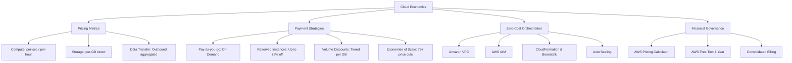

# Economics of Cloud Infrastructure

Financial and operational mechanics of hyperscale cloud environments, analyzing cost reduction vectors, capacity commitment models, and workload cost estimation.

> [!abstract] Lecture Summary
> Cloud economics replaces upfront capital expenditures (CapEx) with dynamic variable operating expenses (OpEx). Hyperscalers like AWS leverage massive economies of scale to offer three primary pricing dimensions (compute, storage, and data transfer) alongside tiered payment flexibility—ranging from on-demand pay-as-you-go billing to 75% discounted reserved capacity, automated volume tiering, zero-dollar orchestration primitives, and pre-deployment estimation via the AWS Pricing Calculator.

---

## 1. Core Economic Drivers & Market Position

When analyzing cloud economics, AWS serves as the standard industry benchmark due to its hyperscale infrastructure and dominant market footprint. Building and maintaining private data centers incurs prohibitive fixed costs that yield no differentiated commercial advantage unless an enterprise sells raw infrastructure for profit.

### Shift from CapEx to OpEx
- **Elimination of Capital Outlays (CapEx)**: No upfront investment for real estate leases, physical server purchases, power plants, cooling, or static enterprise software licenses.
- **Lower Variable Costs (OpEx)**: Organizations only pay for resources actively provisioned, converting fixed physical overhead into fluid operational expenses.
- **Business Agility**: Infrastructure scales dynamically to match shifting demand, enabling engineering teams to refocus on product innovation rather than hardware procurement.

---

## 2. Fundamental Pricing Dimensions

AWS meters resource consumption across three primary dimensions:

| Resource Dimension | Billing Unit | Metering Behavior & Nuance |
| :--- | :--- | :--- |
| **Compute** | Per second or per hour | Rates depend on instance family, vCPU count, memory footprint, and operating system. |
| **Storage** | Per GB-month | Rates vary by performance tier (e.g., S3 Standard vs. Glacier, EBS gp3 vs. io2). |
| **Data Transfer** | Per GB outbound | Inbound data transfer is **free**; intra-region cross-service transfer is generally **free**; outbound transfer to the internet is aggregated and billed as `AWS Data Transfer Out`. |

> [!tip] Bandwidth Verification
> Always verify cross-AZ and cross-region transfer requirements before architecting data-heavy systems. While inbound traffic is free, inter-region replication and external egress incur cumulative per-GB charges.

---

## 3. How You Pay for AWS (Payment Pillars)

AWS provides five operational payment mechanisms that reward scale, commitment, and efficient architecture:

### 1. Pay for What You Use (Pay-As-You-Go / On-Demand)
- Zero initial down payment or long-term contracts.
- Granular per-second or per-hour billing adapted for unpredictable or spiky workloads.
- Complete flexibility to decommission unused capacity immediately to eliminate idle spending.

### 2. Pay Less When You Reserve (Reserved Capacity / RIs)
Investing in committed capacity for predictable, steady-state workloads (such as Amazon EC2 instances and Amazon RDS databases) yields up to **75% savings** over on-demand rates.

AWS provides three upfront commitment tiers:
- **All Upfront Reserved Instance (AURI)**: 100% payment upfront; unlocks the largest percentage discount.
- **Partial Upfront Reserved Instance (PURI)**: Partial upfront payment; balances lower initial cash outlay with a significant discount.
- **No Upfront Reserved Instance (NURI)**: 0% down payment; offers a modest discount while preserving working capital for other projects.

### 3. Pay Less by Using More (Volume-Based Tiering)
- Storage services (Amazon S3, Amazon EBS, Amazon EFS) utilize graduated pricing tiers.
- As storage footprint expands into higher terabyte/petabyte thresholds, the per-GB rate systematically drops.
- Aggregated organizational usage accelerates progression into cheaper pricing tiers.

### 4. Pay Even Less as AWS Grows (The Hyperscale Dividend)
- AWS systematically reduces operational overhead by optimizing custom silicon (Graviton), power efficiency, and hardware supply chains.
- Continuous cost optimizations are passed down to customers: AWS has proactively reduced prices **75 times** between 2006 and September 2019.
- Next-generation hardware generations periodically replace existing instances at equivalent or lower price points.

### 5. Custom Pricing
- Enterprise accounts running high-capacity projects with distinct architectural requirements can negotiate custom pricing agreements with AWS.

---

## 4. Workload Services Highlighted in Cloud Economics

### Amazon EC2 (Elastic Compute Cloud)
- Provides resizable, on-demand virtual compute instances in the cloud.
- Instance types balance compute, memory, storage, and networking profiles to match workload requirements without over-provisioning.
- Horizontal scaling allows adding capacity for periodic or heavy processing spikes and reducing instances during traffic lulls.

### Amazon RDS (Relational Database Service)
- Fully managed relational database engine eliminating routine operational burdens (patching, automated backups, hardware maintenance, disaster recovery).
- Broad engine compatibility: MySQL, PostgreSQL, MariaDB, Microsoft SQL Server, Oracle Database, and IBM Db2.
- High Availability (HA) via synchronous Multi-AZ primary/standby replication and read replicas for horizontal read-scaling.

---

## 5. Free-Tier Offerings & Zero-Cost Orchestration

### AWS Free Tier
Provides hands-on experience for new accounts during their first 12 months:
- **Compute**: 750 hours/month of Amazon EC2 `t2.micro` or `t3.micro` instances.
- **Complementary Services**: Allowances for Amazon S3 (5 GB standard storage), Amazon EBS (30 GB), Elastic Load Balancing, and outbound data transfer.

### Services with No Additional Management Charge
AWS provides several control plane, governance, and automation tools at zero extra licensing cost (users pay only for underlying compute, storage, or network resources provisioned):

- **Amazon VPC (Virtual Private Cloud)**: Custom software-defined network isolation, subnets, and routing tables.
- **AWS IAM (Identity and Access Management)**: Granular role-based access control, authentication, and permission policies.
- **AWS Organizations & Consolidated Billing**:
	- Consolidates multiple member accounts into a single payer account.
	- Centralizes invoice tracking and cost allocation tags.
	- Aggregates cross-account usage to reach volume-based tiered discounts faster.
- **AWS CloudFormation**: Declarative Infrastructure-as-Code (IaC) templating for reproducible stack deployments.
- **AWS Elastic Beanstalk**: Platform-as-a-Service (PaaS) orchestration automating provisioning, load balancing, and scaling.
- **AWS Auto Scaling**: Dynamic capacity management ensuring workloads scale up for performance and scale down to zero idle waste.

---

## 6. Financial Modeling: AWS Pricing Calculator

Pre-deployment estimation prevents cloud billing surprises. The [AWS Pricing Calculator](https://calculator.aws) enables architects to:
- Model projected monthly and annual operational expenditure before writing code.
- Test alternative instance families, storage tiers, and regional cost differentials.
- Compare on-demand pricing against AURI, PURI, and NURI reservation contracts.
- Group services into logical application tiers (frontend, backend, database) for granular stakeholder reporting.

---

## 7. Tasks & Practical Review

- [ ] Explore the [AWS Pricing Calculator](https://calculator.aws) to estimate monthly costs for an EC2 + RDS multi-AZ deployment.
- [ ] Model the cost differential between On-Demand EC2 vs. AURI / PURI / NURI 1-year commitments.

---

## 8. Key Takeaways & Review Questions

- **Three primary cloud pricing dimensions**:
	- Compute (metered per second or hour by instance type)
	- Storage (metered per GB-month across storage classes)
	- Data Transfer (outbound billed per GB; inbound and intra-region intra-service free)
- **Three core payment strategies in AWS**:
	- Pay for what you use (on-demand utility model, no lock-in)
	- Pay less when you reserve (RIs up to 75% savings via AURI, PURI, NURI)
	- Pay less by using more (volume tiering on S3/EBS/EFS)
- **Zero-fee orchestration primitives**: Amazon VPC, AWS IAM, Consolidated Billing, CloudFormation, Beanstalk, and Auto Scaling do not carry separate software fees.

---

## Related Notes
- [[Academic MOC]]
- [[Cloud Architecture & Delivery Models]]
- [[Cloud Computing Overview]]
- [[Computer Networks MOC]]
