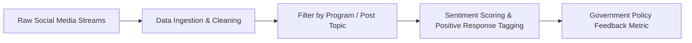

# Data Management & Public Sentiment Analysis

Lecture notes from Pak Marlon focusing on applied data mining methodologies for evaluating public sentiment toward governmental communication programs.

> [!info] Session Details & Logistics
> - **Instructor**: Pak Marlon
> - **Attendance Policy**: Lecture begins ~08:00; admission permitted until 08:30.
> - **Context**: Research field report following municipal communication studies in Ambon.

---

## 1. Research Case Study: Municipal Social Media Analytics

The field study in Ambon examined citizen-government interaction channels across social media platforms, emphasizing systematic data extraction and sentiment filtering.

### Methodological Workflow
1. **Unstructured Data Gathering**: Harvesting public commentary, post interactions, and citizen responses across public social networks.
2. **Program Filtering**: Segmenting scraped feedback by specific municipal initiatives and policy announcements.
3. **Sentiment Classification**: Filtering and isolating posts exhibiting positive community reception to quantify policy communication efficacy.

---

## Related Notes
- [[Academic MOC]]
- [[Data Structures & Algorithms - Fundamentals]]
- [[SkillSpector AI Security Audit]]
