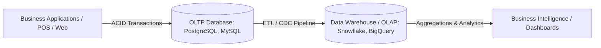

# Enterprise Data Systems Architecture

Architectural principles behind large-scale enterprise data management, transactional storage engines, analytic data warehouses, and distributed ETL pipelines.

> [!abstract] Scope
> Enterprise data systems bridge high-concurrency transactional processing (OLTP) with multi-terabyte analytical queries (OLAP), ensuring data integrity, compliance, and distributed availability across corporate organizational units.

---

## 1. Transactional vs Analytical Processing (OLTP vs OLAP)

| Dimension | OLTP (Online Transaction Processing) | OLAP (Online Analytical Processing) |
| :--- | :--- | :--- |
| **Primary Focus** | Day-to-day real-time transactions | Historical trend analysis, strategic reporting |
| **Data Schema** | Highly normalized (3NF) to eliminate redundancy | Denormalized (Star schema, Snowflake schema) |
| **Query Pattern** | Simple reads/writes targeting single row IDs | Complex multi-table aggregations scanning millions of rows |
| **Integrity Model** | Strict ACID guarantees | Eventual consistency, columnar compression |
| **Latency Expectation**| Millisecond response times | Seconds to minutes depending on scan volume |

---

## 2. Ingestion & Transformation Pipelines (ETL vs ELT)

- **ETL (Extract, Transform, Load)**: Data is transformed on a dedicated processing cluster before ingestion into the storage layer. Standard in legacy systems with limited warehouse compute.
- **ELT (Extract, Load, Transform)**: Raw unstructured or semi-structured data is loaded directly into a cloud data lake or modern warehouse, leveraging massive parallel processing (MPP) engines to run transformations on-demand.

---

## 3. Distributed Data Governance & ACID Bounds
- **Atomicity**: Complete transaction commit or full rollback.
- **Consistency**: Maintaining valid schema constraints and foreign key invariants.
- **Isolation**: Serializability or Snapshot Isolation mitigating dirty reads and phantom updates.
- **Durability**: Non-volatile write-ahead logging (WAL) ensuring commit persistence through hardware failures.

---

## Related Notes
- [[Academic MOC]]
- [[Data Management & Social Sentiment Analysis]]
- [[Cloud Architecture & Delivery Models]]
- [[CompTIA Network+ Exam Tips#Enterprise & Cloud Architecture]]
