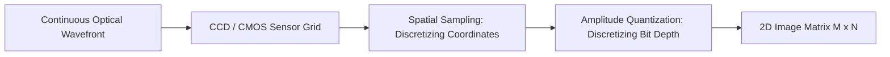

# Digital Image Processing Fundamentals

Mathematical and computational principles governing 2D discrete spatial signal manipulation, matrix kernels, and pixel transformation pipelines.

> [!abstract] Core Concept
> A digital image is represented computationally as a two-dimensional discrete spatial function $f(x, y)$, where spatial coordinates $(x, y)$ map to discrete intensity levels (gray levels) or multi-channel color vectors (RGB/HSV).

---

## 1. Mathematical Representation & Sampling

- **Spatial Sampling**: Discretizing continuous physical dimensions into a finite raster grid of pixels ($M \times N$).
- **Intensity Quantization**: Discretizing light amplitude into integer values based on bit depth:
  $$L = 2^k \quad (k = 8 \implies 256\text{ levels: } [0, 255])$$

---

## 2. Spatial Domain Operations & Convolution

Transforming pixel values directly in the coordinate grid without converting to frequency domains:
$$g(x, y) = T[f(x, y)]$$

### Neighborhood Operations & 2D Convolution
Filtering applies a sliding matrix kernel ($W$) across local pixel neighborhoods:
$$g(x, y) = \sum_{s=-a}^{a} \sum_{t=-b}^{b} w(s, t) \cdot f(x + s, y + t)$$

| Filter Type | Primary Kernel Operation | Target Application |
| :--- | :--- | :--- |
| **Smoothing / Blurring** | Box filter, Gaussian kernel | High-frequency noise suppression, anti-aliasing |
| **Edge Detection** | Sobel operator, Prewitt, Laplacian | Detecting sharp intensity gradients / boundaries |
| **Sharpening** | High-boost filtering, unsharp masking | Enhancing fine texture detail and structural contrast |

---

## 3. High-Level Course Roadmap
1. Intensity transformations and histogram equalization.
2. Spatial filtering (linear vs non-linear median filtering).
3. Frequency domain analysis (2D Discrete Fourier Transform - 2D DFT).
4. Morphological image processing (dilation, erosion, opening, closing).
5. Image segmentation and feature extraction for machine vision.

---

## Related Notes
- [[Academic MOC]]
- [[Data Structures & Algorithms - Fundamentals]]
- [[Computer Architecture & CPU Fetch Cycle]]
- [[Machine Learning Foundations & Supervised Learning]]
