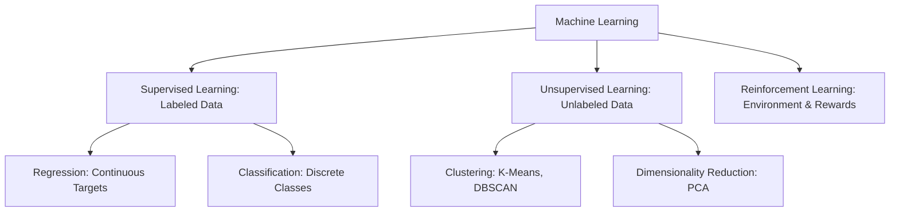

# Machine Learning Foundations & Supervised Learning

Mathematical formulations, loss function optimization, and model validation frameworks across classical machine learning paradigms.

> [!abstract] Core Paradigm
> Machine learning replaces manually hand-crafted rule heuristics with data-driven statistical models that optimize mathematical objective functions to infer predictive mappings from empirical feature spaces.

---

## 1. Machine Learning Paradigms

- **Supervised Learning**: Training on input-output pairs $(X, y)$ to discover a hypothesis function $h(X) \approx y$.
  - *Regression*: Predicting continuous numeric targets (e.g., price estimation, resource consumption forecasting).
  - *Classification*: Assigning discrete categorical class labels (e.g., sentiment polarity, spam detection, malware identification).
- **Unsupervised Learning**: Uncovering latent distributions and geometric structure without ground-truth labels.
- **Reinforcement Learning**: Agent policy optimization through trial, state transitions, and environmental scalar reward signals.

---

## 2. Loss Functions & Gradient Descent Optimization

### Mean Squared Error (MSE) for Regression
$$J(\theta) = \frac{1}{2m} \sum_{i=1}^{m} \left( h_\theta(x^{(i)}) - y^{(i)} \right)^2$$

### Batch Gradient Descent Parameter Update
Parameters $\theta_j$ are iteratively updated opposite the direction of the cost function gradient:
$$\theta_j := \theta_j - \alpha \frac{\partial}{\partial \theta_j} J(\theta)$$
where $\alpha$ represents the learning rate hyperparameter.

---

## 3. Evaluation Metrics & Generalization
- **Confusion Matrix**: True Positives (TP), False Positives (FP), True Negatives (TN), False Negatives (FN).
- **Precision**: $\frac{\text{TP}}{\text{TP} + \text{FP}}$ (minimizes false alarms).
- **Recall (Sensitivity)**: $\frac{\text{TP}}{\text{TP} + \text{FN}}$ (minimizes missed detections).
- **F1-Score**: Harmonic mean: $2 \cdot \frac{\text{Precision} \cdot \text{Recall}}{\text{Precision} + \text{Recall}}$.
- **The Bias-Variance Tradeoff**: Balancing underfitting (high bias, overly rigid assumptions) against overfitting (high variance, memorizing training noise).

---

## Related Notes
- [[Academic MOC]]
- [[Data Structures & Algorithms - Fundamentals]]
- [[Data Management & Social Sentiment Analysis]]
- [[Digital Image Processing Fundamentals]]
- [[SkillSpector AI Security Audit]]
