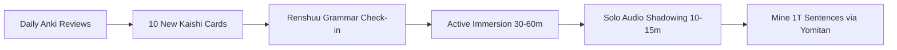

# 🔄 The Moe Way (TMW) Beginner Study Loop

> [!QUOTE] Core Philosophy
> "Do not serialize your learning. Do not learn all kana, then all 1500 words in Kaishi, then all grammar before finally immersing. You must do a bit of everything each day." — *The Moe Way*

---

## 1. The 70:30 Golden Ratio
- **70% Listening / Immersion**: Spoken Japanese is the primary biological form of language. Ear training must precede eye parsing.
- **30% Grammar & Reading**: Analytical framework to decode what you hear and read.

---

## 2. The Three Levels of Listening
1. **Level 1 (Free-Flow Listening)**:
   - Listen to podcasts or anime without pausing or looking up words.
   - Purpose: Develops rhythm, stamina, and tolerance for ambiguity.
2. **Level 2 (Pop-Out Lookups)**:
   - Let the audio run freely, pausing only when a word you recognize or a recurring term pops out at you.
   - Purpose: The primary sweet spot for beginner gains.
3. **Level 3 (Intensive Dissection)**:
   - Pausing at every single unknown word and checking grammar.
   - Caution: High fatigue. Use sparingly during deep weekend study blocks.

---

## 3. Active vs. Passive Immersion
- **Active Immersion**: Eyes on the screen, ears dialed in, full attention. High cognitive gains.
- **Passive Immersion**: Japanese audio running in the background during commutes, dishwashing, or walking. Fills dead time without fatigue.

---

## 4. The Daily Beginner Workflow

---

## 5. Anki Kaishi 1.5k Configuration Checklist
- [ ] Download Anki on Linux / Android.
- [ ] Download and import `Kaishi 1.5k.apkg`.
- [ ] Open Deck Options -> set **Maximum reviews/day** to `9999` (uncapped).
- [ ] Set **New cards/day** to `10` (sustainable for busy days; raise to 15-20 on weekends).
- [ ] Delete or suspend the introductory instruction card.
