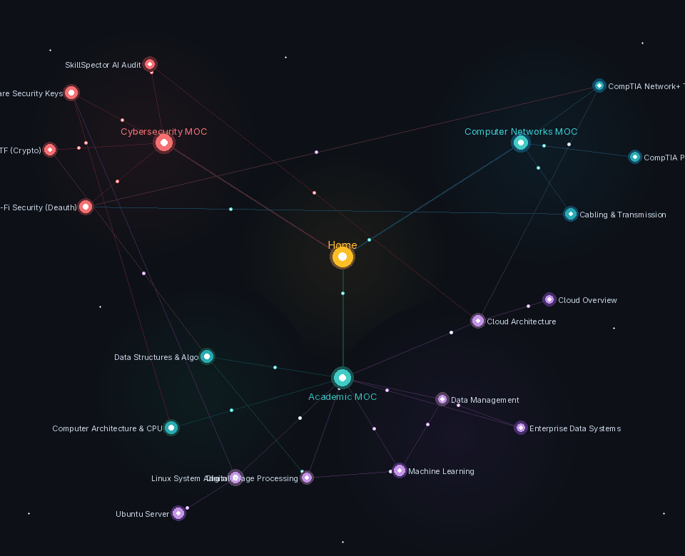
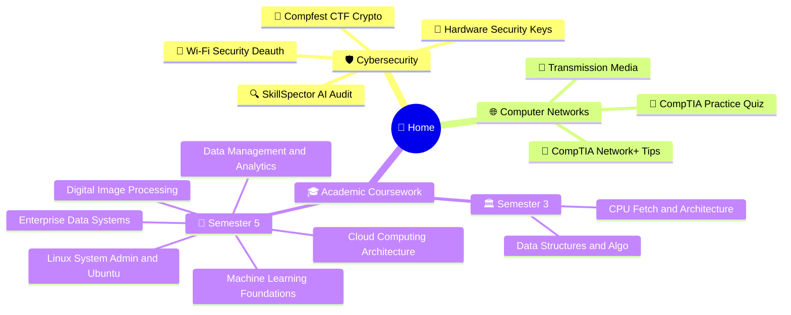

# 🌌 Personal Knowledge Vault & Second Brain

Personal knowledge repository synchronized across desktop and mobile. Built with Obsidian, structured with Maps of Content (MOCs), and tracked under Git version control.

---

## 🕸️ Neural Knowledge Graph



*Live animated neural graph. The golden nucleus marks the central Home dashboard, surrounded by Cybersecurity (crimson), Computer Networks (azure), and Academic Coursework (emerald and violet).*

---

## 🧠 Domain Mindmap



---

## 📂 Vault Hierarchy

```text
.
├── Academics/
│   ├── Academic MOC.md
│   ├── Semester 3/
│   │   ├── Computer Architecture & CPU Fetch Cycle.md
│   │   └── Data Structures & Algorithms - Fundamentals.md
│   └── Semester 5/
│       ├── Cloud Computing/
│       ├── Data Management/
│       ├── Enterprise Data System/
│       ├── Image Processing/
│       ├── Machine Learning/
│       └── System Administrator/
├── Attachments/
│   ├── vault_graph.gif
│   ├── vault_graph.svg
│   ├── PRAKTIKUM CHAPTER 2.pdf
│   └── becomingahackerday11780258583150.pdf
├── Cybersecurity/
│   ├── Compfest CTF Writeup - Crypto & Forensics.md
│   ├── Cybersecurity MOC.md
│   ├── Hardware Security Keys - FIDO2 & WebAuthn.md
│   ├── SkillSpector AI Security Audit.md
│   └── Wi-Fi Security - Deauth & Handshake Capture.md
├── Home.md
├── Networking/
│   ├── CompTIA Network+ Exam Tips.md
│   ├── CompTIA Network+ Practice Questions.md
│   ├── Computer Networks MOC.md
│   └── Network Transmission Media & Cabling.md
└── Templates/
    ├── Academic Lecture Note.md
    ├── Cybersecurity Audit Note.md
    └── Networking Concept Note.md
```

---

## 🔄 Sync Architecture
- **Desktop (CachyOS Linux)**: Native Git engine interfacing with the `obsidian-git` community plugin. Configured to auto-pull on boot and commit changes every 10 minutes.
- **Mobile (Android/iOS)**: `obsidian-git` using isomorphic-git over HTTPS, authenticated via a scoped GitHub Personal Access Token (PAT).
- **Workspace Protection**: `.obsidian/workspace*.json` and local temporary caches are excluded via `.gitignore` to prevent multi-device merge conflicts.
